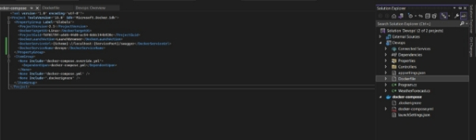
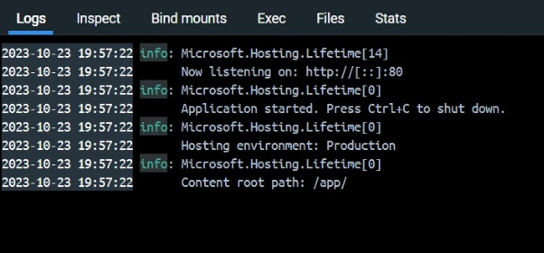
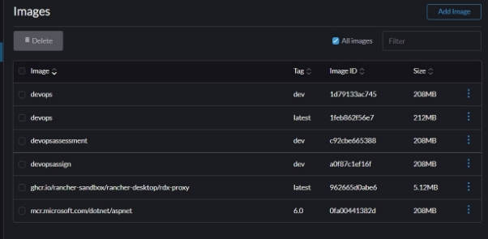
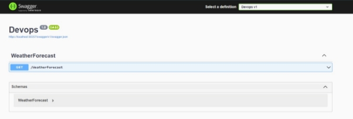

`		`Gowtham S

**Devops – Final Assessment**

**Section 1: Multiple-Choice Questions (MCQs)**
**

1\. What does WSL stand for in the context of Windows?

a. Windows Software Locator

b. Windows System Locator

c. Windows Subsystem for Linux

d. Windows Shell Language

` `Answer: c. Windows Subsystem for Linux

Reason: WSL, or Windows Subsystem for Linux, is a compatibility layer in Windows that allows running Linux applications natively. It stands for Windows Subsystem for Linux.

2\. What is the primary goal of continuous integration (CI) in DevOps?

a. Automating manual testing

b. Frequent integration of code changes

c. Managing cloud infrastructure

d. Monitoring server performance

Answer: b. Frequent integration of code changes

Reason: The primary goal of continuous integration (CI) is to frequently integrate code changes into a shared repository, ensuring that code changes from multiple developers are integrated and tested as often as possible.

3\. In the Linux command line, what does the cd command do?

a. Copy files and directories

b. Change the working directory

c. Create a new directory

d. Calculate directory size

Answer: b. Change the working directory

Reason: The "cd" command in the Linux command line is used to change the current working directory, allowing you to navigate the file system.

4\. Which of the following is not a Linux distribution?

a. Ubuntu

b. CentOS

c. Docker

d. Debian

Answer: c. Docker

Reason: Docker is not a Linux distribution; it is a platform for containerization and application deployment. Linux distributions include Ubuntu, CentOS, Debian, and others.

5\. What is Docker primarily used for in DevOps and containerization?

a. Managing cloud infrastructure

b. Running virtual machines

c. Packaging and deploying applications in containers

d. Managing network security

Answer: c. Packaging and deploying applications in containers

Reason: Docker is primarily used for packaging applications and their dependencies into containers, making it easier to deploy, manage, and scale applications in a consistent and isolated environment.

6\. What is the primary purpose of Azure DevOps?

a. Infrastructure management

b. Software development and delivery

c. Network security

d. Virtualization

` `Answer: b. Software development and delivery

Reason: Azure DevOps is a set of DevOps tools and services provided by Microsoft for software development and delivery. Its primary purpose is to support the entire software development lifecycle, including planning, coding, building, testing, and delivery.

7\. Which components are part of Azure DevOps?

a. Azure App Service and Azure Functions

b. Azure Monitor and Azure Security Center

c. Azure Boards and Azure Pipelines

d. Azure Virtual Machines and Azure SQL Database

Answer: c. Azure Boards and Azure Pipelines

`   `Reason: Azure DevOps consists of several components, including Azure Boards for work item tracking and Azure Pipelines for continuous integration and continuous delivery (CI/CD). These are two of the key components.

8\. How does Azure DevOps support version control in software development?

a. It provides automated database backups.

b. It tracks changes in source code and manages versions.

c. It monitors server performance.

d. It optimizes network configurations.

Answer: b. It tracks changes in source code and manages versions.

Reason: Azure DevOps includes version control tools (e.g., Azure Repos) that track changes in source code, manage versions, and facilitate collaborative development by multiple team members.

9\. In Linux, what is the primary role of the root user?

a. Managing user accounts

b. Running GUI applications

c. Administrative tasks with superuser privileges

d. Monitoring network traffic

Answer: c. Administrative tasks with superuser privileges

`   `Reason: The root user in Linux has superuser privileges and is responsible for performing administrative tasks, managing the system, and making system-wide changes.

10\. In Azure DevOps, which component is used to define, build, test, and deploy

applications?

a. Azure Boards

b. Azure Repos

c. Azure Pipelines

d. Azure Artifacts

Answer: c. Azure Pipelines

Reason: Azure Pipelines is used to define, build, test, and deploy applications in a continuous integration and continuous delivery (CI/CD) pipeline, making it an essential component for software development and deployment in Azure DevOps.

**Section 2: Labs**

**Lab 1: File and Directory Management**

Tasks:

1\. Create a directory called “lab1” in your home directory.

2\. Inside “lab1” create a text file named “sample.txt” with some content.

3\. Make a copy of “sample.txt” and name it “sample\_copy.txt”

4\. Rename “sample\_copy.txt” to “new\_sample.txt”

5\. List the files in the “lab1” directory to confirm their names.

**Lab 2: Permissions and Ownership**

**Objective: Understand and manage file permissions and ownership.**

**Tasks:**

1\. Create a new file named “secret.txt” in the “lab2” directory.

2\. Set the file permissions to allow read and write access only to the

owner.

3\. Change the owner of “secret.txt” to another user.

4\. Verify the new permissions and owner using the ls -l and ls -n

commands.

**Lab 3: Text Processing with Command Line Tools**

**Objective: Practice text processing using command-line tools.**

**Tasks:**

1\. Create a text file with some random text in the “lab3” directory.

2\. Use the grep command to search for a specific word or pattern in the

file.

3\. Use the sed command to replace a word or phrase with another in the

file.

4\. Use the wc command to count the number of lines, words, and

characters in the file.

**Lab 4: Creating a Simple YAML File**	

**Objective: Create a basic YAML configuration file.**

**Task:**

1\. Create a YAML file named “config.yaml”

2\. Define key-value pairs in YAML for a fictitious application, including

name, version, and description.

3\. Save the file.

4\. Validate that the YAML file is correctly formatted.

**

**Lab 5: Working with Lists in YAML**

**Objective: Practice working with lists (arrays) in YAML.**

**Task:**

1\. Create a YAML file named “fruits.yaml”

2\. Define a list of your favorite fruits using YAML syntax.	

3\. Add items from the list.

4\. Save and validate the YAML file.

![ref1]

**With Error :**

![ref2]

**Without Error :**

**Lab 6: Nested Structures in YAML**

**Objective: Explore nested structures within YAML.**

**Task:**

1\. Create a YAML file named “data.yaml”

2\. Define a nested structure representing a fictitious organization with

departments and employees.

3\. Use YAML syntax to add, update, or remove data within the nested

structure.

4\. Save and validate the YAML file.

**Adding Data**

**Updating Data**

**Removing Data**

**Lab 7: Create Classic Azure CI Pipeline for Angular Application**

**Objective: Set up a classic Azure CI pipeline to build a simple Angular**

**application with unit testing using Jasmine and Karma.**

**Tasks:**

1\. Create an Azure DevOps project.

2\. Set up a classic CI pipeline to build an Angular application.

3\. Configure the pipeline to use Jasmine and Karma for unit testing.

4\. Run the pipeline and validate the test results.

**

**Lab 8: Create YAML Azure CI Pipeline for React Application**

**Objective: Create a YAML-based Azure CI pipeline to build a simple React**

**application with unit testing using Enzyme and Jest.**

**Tasks:**

1\. Create an Azure DevOps project.

2\. Create a YAML-based CI pipeline to build a React application.

3\. Configure the pipeline to use Enzyme and Jest for unit testing.

4\. Trigger the pipeline and verify the test results.

**Lab 9: Create CI Pipeline for .NET Core Application with MS Unit Test**

**Objective: Create a CI pipeline, either classic or YAML, to build a .NET Core**

**application and run MS Unit tests.**

**Tasks:**

1\. Set up a new Azure DevOps project.

2\. Create a CI/CD pipeline for a .NET Core application.

3\. Configure the pipeline to use MS Unit tests.

4\. Trigger the pipeline and validate the test results.

**Lab 10: Creating a Docker Image for a .NET Core Web API and Running it in Rancher**

**Desktop**

**Objective: In this lab, you will create a Docker image for a sample .NET Core Web**

**API application and then run the Web API container in Rancher Desktop.**

**Prerequisites:**

**Rancher Desktop installed and running.**

**.NET Core SDK installed on your machine.**

**Tasks**

Step 1: Create a .NET Core Web API Project

Step 2: Build the .NET Core Web API Project

Step 3: Dockerize the .NET Core Web API

Step 4: Build the Docker Image

Step 5: Run the Docker Container in Rancher Desktop

Step 6: Test the .NET Core Web API via swagger

[ref1]: Aspose.Words.09189fdd-c9e8-446e-881c-24aed344ba94.008.png
[ref2]: Aspose.Words.09189fdd-c9e8-446e-881c-24aed344ba94.010.png
